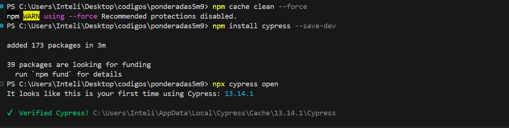
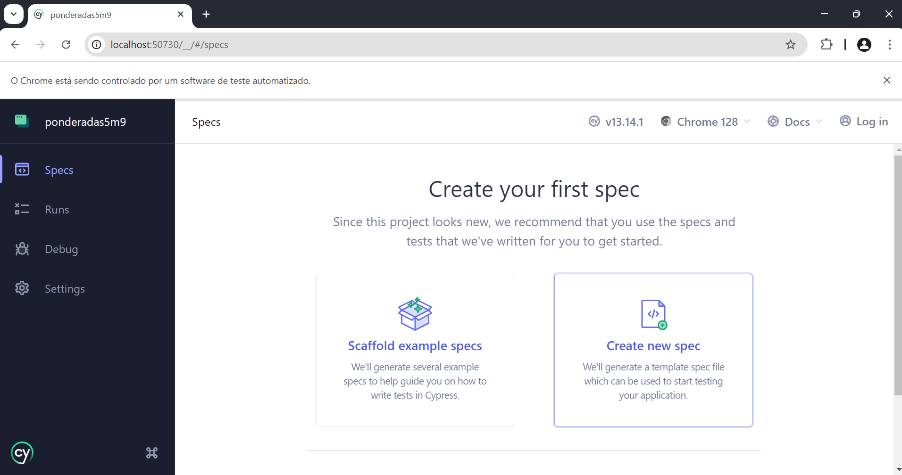
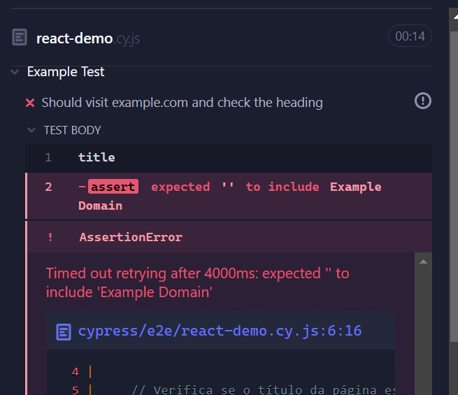
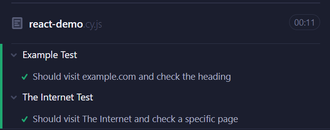

---

# Teste de Aplicações React com Cypress Usando TDD

## Introdução

O Desenvolvimento Orientado a Testes (TDD) é uma metodologia que coloca os testes no centro do processo de desenvolvimento de software. No contexto de testes para aplicações React com Cypress, TDD ajuda a garantir que o código atende aos requisitos desde o início e promove um ciclo de desenvolvimento contínuo e confiável. Cypress é uma ferramenta poderosa para testes end-to-end, permitindo a automação de testes de forma simples e eficaz.

## Instalação do Cypress

Antes de começar com TDD e Cypress, é necessário instalar e configurar o Cypress. Instalação:

1. **Crie um novo projeto e inicialize o `package.json`:**

    ```bash
    npm init -y
    ```

2. **Instale o Cypress como uma dependência de desenvolvimento:**

    ```bash
    npm install cypress --save-dev
    ```

    


3. **Abra o Cypress para configurar a estrutura inicial do projeto:**

    ```bash
    npx cypress open
    ```

    Isso criará a estrutura de diretórios e arquivos necessários para o Cypress.




## Desenvolvimento Orientado a Testes (TDD)

O TDD segue três etapas principais:

1. **Red (Vermelho):** Escrever testes que falham inicialmente porque a funcionalidade ainda não foi implementada.
2. **Green (Verde):** Implementar o código mínimo necessário para passar nos testes.
3. **Refactor (Refatorar):** Melhorar o código mantendo os testes passando.

### Etapa Red: Escrever Testes que Falham

Nessa fase, escrevemos testes que falham porque a funcionalidade ainda não foi implementada. O objetivo é definir claramente o que a funcionalidade deve fazer.

**Teste para Adicionar Elementos**

```javascript
describe('Element Addition Test', () => {
  it('Should add multiple elements and verify their presence', () => {
    
  });
});

describe('Example Domain Test', () => {
  it('Should visit example.com and check the heading', () => {
   
});
}
```




### Etapa Green: Implementar Código para Passar os Testes

Agora, implementamos o código mínimo necessário para fazer os testes passarem. Esse código pode ser básico, mas deve satisfazer os critérios dos testes.

**Implementação Básica:**

```javascript
describe('Element Addition Test', () => {
  it('Should add multiple elements and verify their presence', () => {
    cy.visit('https://the-internet.herokuapp.com');
    cy.contains('Add/Remove Elements').click();
    
    // Adiciona um novo elemento
    cy.get('button').contains('Add Element').click(); // Passará porque o botão "Add Element" está presente
    cy.get('button').should('have.length', 1); // Passará com a configuração inicial
    
    // Adiciona mais elementos
    cy.get('button').contains('Add Element').click();
    cy.get('button').contains('Add Element').click();
    cy.get('button').contains('Add Element').click();
    cy.get('button').contains('Add Element').click();
    cy.get('button').contains('Add Element').click();
    
    // Verifica se a quantidade de elementos é 7
    cy.get('button').should('have.length', 6); // Passará com a quantidade correta de elementos
  });

  describe('Example Domain Test', () => {
  it('Should visit example.com and check the heading', () => {
    // Visita o site de exemplo
    cy.visit('https://example.com');

    // Verifica se o título da página está correto
    cy.title().should('include', 'Example Domain'); // Esperado: Falhar, pois a verificação não pode ser feita sem o conteúdo da página
    cy.get('h1').should('have.text', 'Example Domain'); // Esperado: Falhar, pois o cabeçalho ainda não foi verificado
  });
});
});
```




### Etapa Refactor: Melhorar o Código Mantendo os Testes Passando

Na fase de refatoração, melhoramos o código para torná-lo mais robusto e limpo, garantindo que os testes continuem passando.

**Código Refatorado:**

```javascript
describe('Element Addition Test', () => {
  before(() => {
    // Visita a página de teste antes dos testes
    cy.visit('https://the-internet.herokuapp.com');
    cy.contains('Add/Remove Elements').click();
  });

  it('Should add multiple elements and verify their presence', () => {
    // Adiciona múltiplos elementos
    const addElement = (times) => {
      for (let i = 0; i < times; i++) {
        cy.get('button').contains('Add Element').click();
      }
    };

    addElement(6); // Adiciona 6 elementos

    // Verifica se a quantidade de botões é 7 (1 inicial + 6 adicionados)
    cy.get('button').should('have.length', 7);
  });

describe('Example Domain Test', () => {
  it('Should visit example.com and check the heading', () => {
    cy.visit('https://example.com');
    
    // Verifica se o título da página está correto
    cy.title().should('include', 'Example Domain'); // Passará se o título da página contiver "Example Domain"
    cy.get('h1').should('have.text', 'Example Domain'); // Passará se o cabeçalho da página for "Example Domain"
  });
});
});
```

### Conclusão

O Desenvolvimento Orientado a Testes (TDD) em React é essencial para garantir a qualidade e a robustez das aplicações, e isso inclui a implementação de testes end-to-end (E2E). Os testes E2E validam o funcionamento completo da aplicação ao simular interações reais do usuário e verificar se todas as partes do sistema estão integradas corretamente. Ao adotar o TDD, você escreve testes antes de implementar o código, o que ajuda a definir claramente os requisitos e o comportamento esperado da aplicação. Isso não apenas promove um desenvolvimento mais estruturado e iterativo, mas também permite detectar bugs precocemente e refatorar o código com segurança. Para aplicações React, os testes E2E garantem que cada fluxo de trabalho e funcionalidade sejam verificados de ponta a ponta, assegurando uma experiência de usuário consistente e confiável, além de facilitar a manutenção e a escalabilidade do código ao longo do tempo.
A integração de testes automatizados com Cypress ajuda a identificar e corrigir problemas rapidamente, reduzindo a possibilidade de regressões e melhorando a confiança na evolução contínua da aplicação.

---
